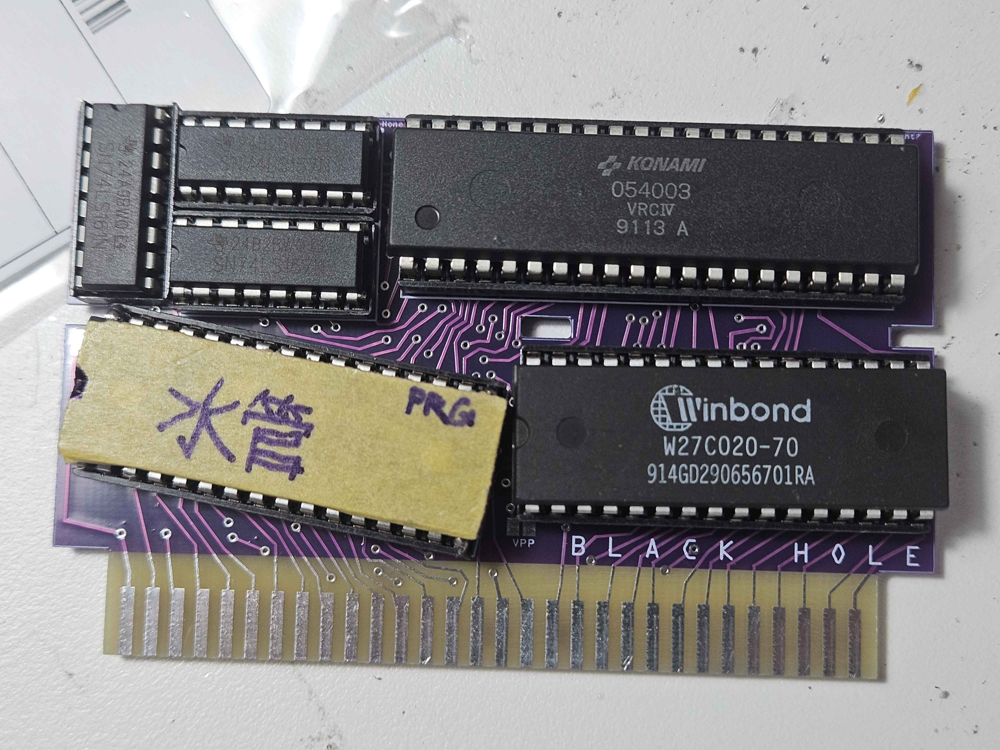

# Famicom Accessories
These are several Fritzing project files for making repro cartridges,
and since these are personal projects i can not guarantee that any of them will work.

**Gerber files are not provided because I don't want to create more folders for them, but you can request them by email. I will respond within 24 hours.**

## STATUS
- Repro-PCB\Mapper183_ShuiGuanPipe.fzz
	- Works perfectly fine
- Repro-PCB\Mapper85_DonkeyKongCountry4VRC7.fzz
	- Done. Needs to be tested (Paused)
- Repro-PCB\Mapper69_FME-7Discrete.fzz
	- 0%
	
- Repro-PCB\Proto.fzz
	- Works perfectly fine
- Repro-PCB\Blank.fzz
	- Works perfectly fine

- Other-PCB\AY-3-8912_AVR.fzz
	- Done. Needs to be tested